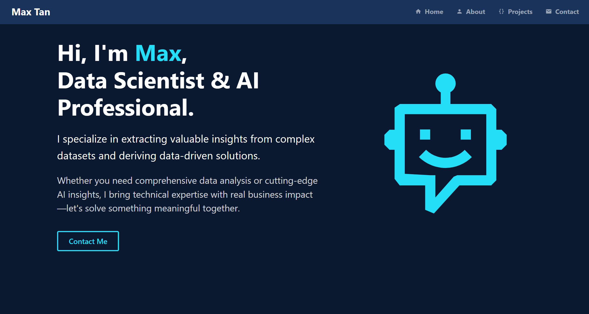
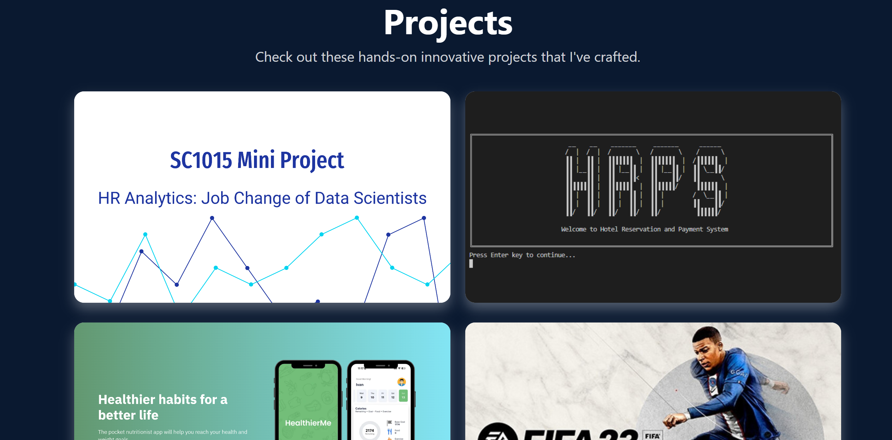
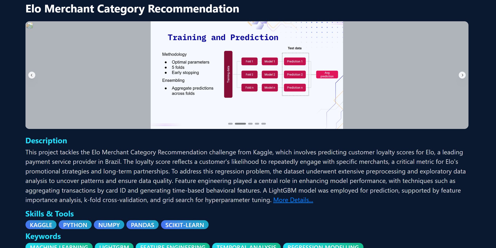

# Portfolio

A modern, interactive portfolio website built with Python Dash showcasing my skills and projects.

## 🚀 [Live Demo](https://maxs-portfolio.onrender.com/)

## Screenshots

### Home Page

### Projects Section

### Project's Details

## Tech Stack

-   **Frontend**: Dash, Dash Bootstrap Components, Dash Mantine Components, Plotly
-   **Backend**: Python, Flask
-   **Deployment**: Render
